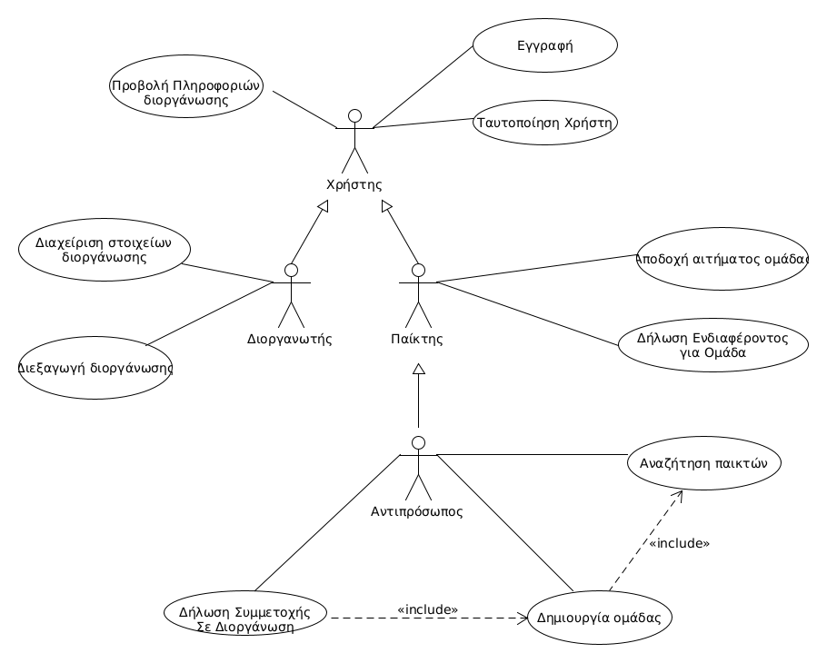
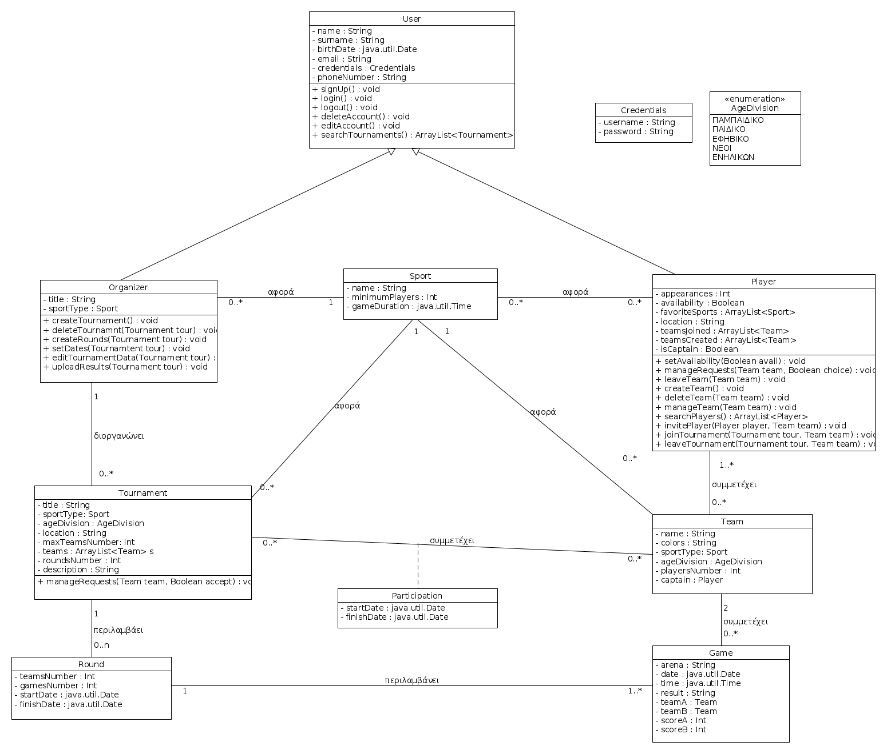

# Εισαγωγή

Το παρόν έγγραφο αφορά το παραδοτέο R2 και αναφέρεται στις απαιτήσεις του λογισμικού με μια ανάλυση συστήματος. Βρίσκονται κατάλληλοι σύνδεσμοι που οδηγούν στην περιγραφή της κάθε περίπτωσης χρήσης ξεχωριστά. Επίσης περιέχει συμπληρωματικές προδιαγραφές για τις μη λειτουργικές απαιτήσεις, το μοντέλο πεδίου που περιλαμβάνει τις βασικές κλάσεις του πεδίου προβλήματος, καθώς και τους επιχειρησιακούς κανόνες της εφαρμογής. 

# Συνολική περιγραφή

## Επισκόπηση μοντέλου περιπτώσεων χρήσης

*Διάγραμμα Περιπτώσεων Χρήσης.*

### **Πίνακας Περιπτώσεων Χρήσης:**

Περιπτώση Χρήσης |  Περιγραφή
------------ | --------------
**ΠΧ1. Προβολή πληροφοριών διοργάνωσης** | Ο χρήστης εγγεγραμένος ή μη θα έχει την δυνατότητα να παρακολουθεί τις γενικότερες πληροφορίες για κάποια διοργάνωση ( αγώνες, βαθμολογίες κλπ.)
**ΠΧ2. Διαχείριση Λογαριασμού Χρήστη** | Ο χρήστης μπορεί δημιουργήσει ή να επεξεργαστεί τον λογαριασμό του.
**ΠΧ3. Ταυτοποίηση Χρήστη** | Ο εγγεγραμμένος χρήστης οφείλει να ταυτοποιείται σε κάθε του σύνδεση στην πλατφόρμα του συστήματος.
**ΠΧ4. Διαχείριση Διοργάνωσης** | Ο διοργανωτής ορίζει τα στοιχεία της διοργάνωσης, πρίν ή μετα τη δημιουργία της.
**ΠΧ5. Διεξαγωγή Διοργάνωσης** | Ο διοργανωτής επιβλέπει και καθοδηγεί τη εξέλιξη της διοργάνωσης.
**ΠΧ6. Αποδοχή αιτήματος ομάδας** | Ο Παίκτης μπορεί να αποδεχτεί αιτήματα για συμμετοχή σε ομάδα, που γίνονται από τους αντιπρόσωπους.
**ΠΧ7. Διαχείριση διαθεσιμότητας** | Ο Παίκτης μπορεί να δηλώσει ότι ενδιαφέρεται να συμμετάσχει σε μία ομάδα για μία διοργάνωση. Αυτή η δήλωση, εγγράφεται στον κατάλογο των παικτών που είναι προς αναζήτηση συμπαικτών.
**ΠΧ8. Δήλωση συμμετοχής σε διοργάνωση** | Κάθε αντιπρόσωπος και μόνος αυτός μπορεί να δηλώσει συμμετοχή για μία ομάδα σε μία διοργάνωση.
**ΠΧ9. Διαχείριση ομάδας** | Κάθε Αντιπρόσωπος έχει την δυνατότητα να διαχειριστεί την ομάδα του για συμμετοχή σε μία διοργάνωση.
**ΠΧ10. Αναζήτηση παικτών** | Σε περίπτωση που υπάρχουν ελλείψεις παικτών από μία ομάδα, ο Αντιπρόσωπος της μπορεί να αναζητήσει παίκτες από τον κατάλογο παικτών που δήλωσαν ενδιαφέρον συμμετοχής σε ομάδα.

# Ειδικές Απαιτήσεις 

## Περιπτώσεις χρήσης

### Οι ενδιαφερόμενοι και οι ανάγκες τους

Ενδιαφερόμενοι |  Ανάγκες
------------ | --------------
*Χρήστης* | Επιθυμεί να πληροφορείται για διοργανώσεις και να δημιουργεί/διαχειρίζεται λογαριασμούς στην πλατφόρμα. Επίσης, επιθυμεί να ταυτοποιείται σε περίπτωση που έχει εγγραφεί ως παίκτης ή ως διοργανωτής.
*Διοργανωτής* | Επιθυμεί να δημιουργεί και να διαχειρίζεται διοργανώσεις, στις οποίες θα συμμετέχουν ομάδες του συστήματος.
*Παίκτης* | Επιθυμεί να λαμβάνει αιτήματα απο ομάδες, ώστε να συμμετέχει σε διοργανώσεις.
*Αντιπρόσωπος* | Επιθυμεί να δημιουργεί/διαχειρίζεται ομάδες, ώστε να προσκαλεί παίκτες και να συμμετέχει σε διοργανώσεις.

### Actors του συστήματος

Actors |  Περιγραφή
------------ | --------------
*Χρήστης* | Κάνει περιήγηση στην εφαρμογή και κάνει εγγραφή αν θέλει να χρησιμοποιήσει και τις υπόλοιπες λειτουργίες της πλατφόρμας.
*Διοργανωτής* | Είναι ένας εγγεγραμμένος χρήστης που δημιουργεί διοργανώσεις.
*Παίκτης* |Είναι ένας εγγεγραμμένος χρήστης που συμμετέχει σε ομάδες.
*Αντιπρόσωπος* | Είναι ένας παίκτης ο οποίος έχει δημιουργήσει ομάδες.

### Περιγραφές περιπτώσεων χρήσης

#### [ΠΧ1. Προβολή πληροφοριών διοργάνωσης](uc1-view-tournament-info.md)

#### [ΠΧ2. Διαχείριση Λογαριασμού](uc2-user-account-management.md)

#### [ΠΧ3. Ταυτοποίηση Χρήστη](uc3-user-verification.md)

#### [ΠΧ4. Διαχείριση διοργάνωσης](uc4-manage-tournament-data.md)

#### [ΠΧ5. Διεξαγωγή Διοργάνωσης](uc5-tournament-conduction.md)

#### [ΠΧ6. Αποδοχή αιτήματος ομάδας](uc6-accept-team-invite.md)

#### [ΠΧ7. Διαχείριση διαθεσιμότητας](uc7-player-availability.md)

#### [ΠΧ8. Δήλωση συμμετοχής σε διοργάνωση](uc8-join-tournament.md)

#### [ΠΧ9. Διαχείριση ομάδας](uc9-manage-team.md)

#### [ΠΧ10. Αναζήτηση παικτών](uc10-player-search.md)

## Συμπληρωματικές προδιαγραφές

\[*Οι επόμενες ενότητες περιέχουν όλες τις μη λειτουργικές απαιτήσεις και τους περιορισμούς σχεδίασης και υλοποίησης.*\]

### Απαιτήσεις διεπαφών

#### Διεπαφές χρήστη

Στην διεπαφή θα υπάρχουν τα εξής στοιχεία:
1. Κουμπία σύνδεσης στο σύστημα με ταυτοποίηση και νέας εγγραφής.
2. Κουπιά για την επιλογή ρόλου κατα την εγγραφή (παίκτης ή διοργανωτής).
3. Φόρμα εισαγωγής των στοιχείων του χρήστη κατα την εγγραφή.
4.  Για τους διοργανωτές: Κουμπί δημιουργίας νέας διοργάνωσης,διαγραφής-τροποποίησης που εμφανίζει μία φόρμα συμπλήρωσης στοιχείων.
5. Για τους παίκτες: Κουμπί δημιουργίας νέας ομάδας, διαγραφής, που εμφανίζει μία φόρμα συμπλήρωσης στοιχείων.
6. Όταν ένας παίκτης είναι αντιπρόσωπος, μπορεί να αναζητήσει άλλους παίκτες μέσω ενός καταλόγου. Εκεί θα υπάρχουν μενού με εφαρμογή φίλτρων αναζήτησης. Εναλλακτικά, θα υπάρχει πεδίο συμπλήρωσης, όπου μπορεί να βρεθεί παίκτης άμεσα μέσω του ονόματός του.
7. Στον αντιπρόσωπο θα εμφανίζονται κουμπιά για την πρόσκληση του παίκτη στην ομάδα και για την ακύρωση πρόσκλησης.
8. Ο αντιπρόσωπος θα μπορεί να αιτηθεί τη συμμετοχή της ομάδας του σε διοργάνωση, με κατάλληλο κουμπί που θα υπάρχει για κάθε διαθέσιμη διοργάνωση.
9. Όλοι οι χρήστες θα μπορούν να περιηγηθούν σε ένα κατάλογο απο τρέχουσες ή ολοκληρωμένες διοργανώσεις, και πατώντας σε μία θα μπορούν να δούν πληροφορίες για αυτή.

#### Διεπαφές υλικού

Για τη χρήση της διεπαφής απαιτείται οθόνη αφής.

#### Διεπαφές επικοινωνίας

Η χρήση της εφαρμογής απαιτεί σύνδεση στο Διαδίκτυο.

#### Διεπαφές λογισμικού

Η πλατφόρμα λειτουργεί μόνο σε συσκευές με το Λειτουργικό Σύστημα Android.

### Περιορισμοί σχεδίασης και υλοποίησης

Η υλοποίηση θα γίνει σε γλώσσα Java και Kotlin, στο περιβάλλον Android Studio.

### Ποιοτικά χαρακτηριστικά

#### Απόδοση

Η πλατφόρμα θα πρέπει να φέρνει εις πέρας τις λειτουργίες σε πραγματικό χρόνο. Αυτό σημαίνει άμεση αποστολή των αιτημάτων συμμετοχής και των αποδοχών, όπως επίσης και του verification mail. Επίσης, θα υποστηρίζει τουλάχιστον 500 ταυτόχρονους χρήστες.

#### Διαθεσιμότητα

1. Η απόκτηση το λογισμικού θα γίνεται είτε μέσω του Google Play, είτε με τον διαμοιρασμό του αρχείου apk . 
2. Το σύστημα θα είναι διαθέσιμο 24 ώρες για 7 ημέρες την εβδομάδα.
3. Ο χρόνος μη διαθεσιμότητας δε θα πρέπει να ξεπερνά το 5%.

#### Ασφάλεια

Διαχωρίζουμε τις δυνατότητες κάθε χρήστη μέσω της ταυτοποίησης του. Έτσι κάποιος παίκτης μπορεί να επεξεργαστεί τα στοιχεία του μόνο αν έχει ταυτοποιηθεί. Με αυτόν τον τρόπο προστατεύονται και οι διοργανωτές, ώστε να έχουν μόνο εκείνοι πρόσβαση στις διοργανώσεις τους.

#### Ευελιξία

1. Κατά την επεξεργασία των στοιχείων διοργάνωσης, όλες οι τροποποιήσεις θα πρέπει να γίνονται 7 ημέρες πριν την έναρξη της διοργάνωσης.
2. Σε περίπτωση που η διοργάνωση έχει ξεκινησεί, ο διοργανωτής μπορεί να αλλάξει μόνο το όνομα της διοργάνωσης.

#### Ευχρηστία

Όλα τα στοιχεία της διεπαφής θα έχουν κατάλληλο μέγεθος ώστε να διακρίνονται εύκολα. Σε κάθε οθόνη θα υπάρχουν μόνο στοιχεία που είναι αναγκαία για τους στόχους του χρήστη, και θα αποφεύγουμε τα έντονα χρώματα. Η περιήγηση στην πλατφόρμα θα μπορεί να γίνει έυκολα, χωρίς την χρήση manual. Η μόνη προϋπόθεση για τον τελικό χρήστη είναι να γνωρίζει τη χρήση μιας απλής εφαρμογής Android. 

# Υποστηρικτικό υλικό

## Μοντέλο πεδίου

## Επιχειρησιακοί κανόνες

\[*Ένας πίνακας με του επιχειρησιακούς κανόνες.*\]

| Επιχειρησιακοί κανόνες | Περιγραφή |
| :----------------------| :---------|
| ΕΚ1 | Το username κάθε χρήστη πρέπει να είναι μοναδικό. 
| ΕΚ2 | Η ηλικία των παικτών θα πρέπει να είναι άνω των 7 ετών.
| ΕΚ3 | Ο αριθμός τηλεφώνου κάθε χρήστη πρέπει να έχει 10 ψηφία.
| ΕΚ4 | Το όνομα της κάθε ομάδας θα πρέπει να είναι μοναδικό.
| ΕΚ5 | Κάθε ομάδα ανάλογα με την ηλικιακή κατηγορία της, μπορεί να συμμετέχει στην διοργάνωση με την αντίστοιχη ηλικιακή κατηγορία.
| ΕΚ6 | Κάθε διοργάνωση πρέπει να έχει έναν και μόνο νικητή.
| ΕΚ7 | Δεν μπορεί να κλείσει ή να διαγραφεί διοργάνωση όταν υπάρχουν αγώνες σε εξέλιξη.
| ΕΚ8 | Δεν μπορούν να συνυπάρχουν στην ίδια ομάδα άτομα, με μεγάλο εύρος στην ηλικία τους ( π.χ. 17 χρονών με 10 χρονών ).
| ΕΚ9 | Τα username και τα password πρέπει να αποτελούνται απο 5 τουλάχιστον χαρακτήρες.
| ΕΚ10 | Τα email πρέπει να είναι της μορφής : name@mailserver.domain .
| ΕΚ11 | Η ηλικία των διοργανωτών θα πρέπει να είναι άνω των 18 ετών.
| ΕΚ12 | Ο τίτλος είναι διαφορετικός για κάθε διοργανωτή.
| ΕΚ13 | Κάθε παίκτης μπορεί να συμμετέχει σε μία ομάδα για μία συγκεκριμένη διοργάνωση.
| ΕΚ14 | Αν καλυφθούν όλες οι θέσεις σε μια διοργάνωση δεν μπορεί να προστεθέι άλλη ομάδα.
| ΕΚ15 | Αν μια ομάδα συμμετέχει σε τρέχοντα γύρο διοργάνωσης δεν μπορεί να αποχωρήσει από αυτή.
| ΕΚ16 | Το όνομα της κάθε διοργάνωσης θα πρέπει να είναι μοναδικό.
| ΕΚ17 | Ο διοργανωτής δεν μπορεί να τροποποιήσει βασικά στοιχεία όπως εγκαταστάσεις, αριθμός ομάδων κλπ, όταν η διοργάνωση βρίσκεται κοντά στην έναρξη της( 7 μέρες και κάτω) ή κατά τη διάρκειά της.
