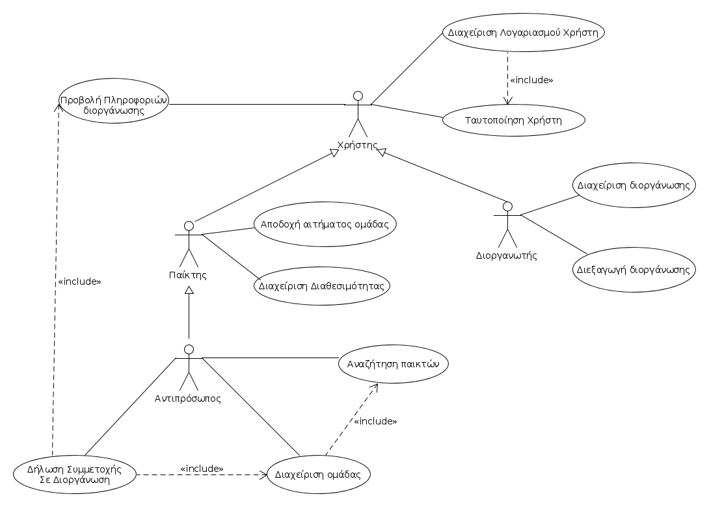
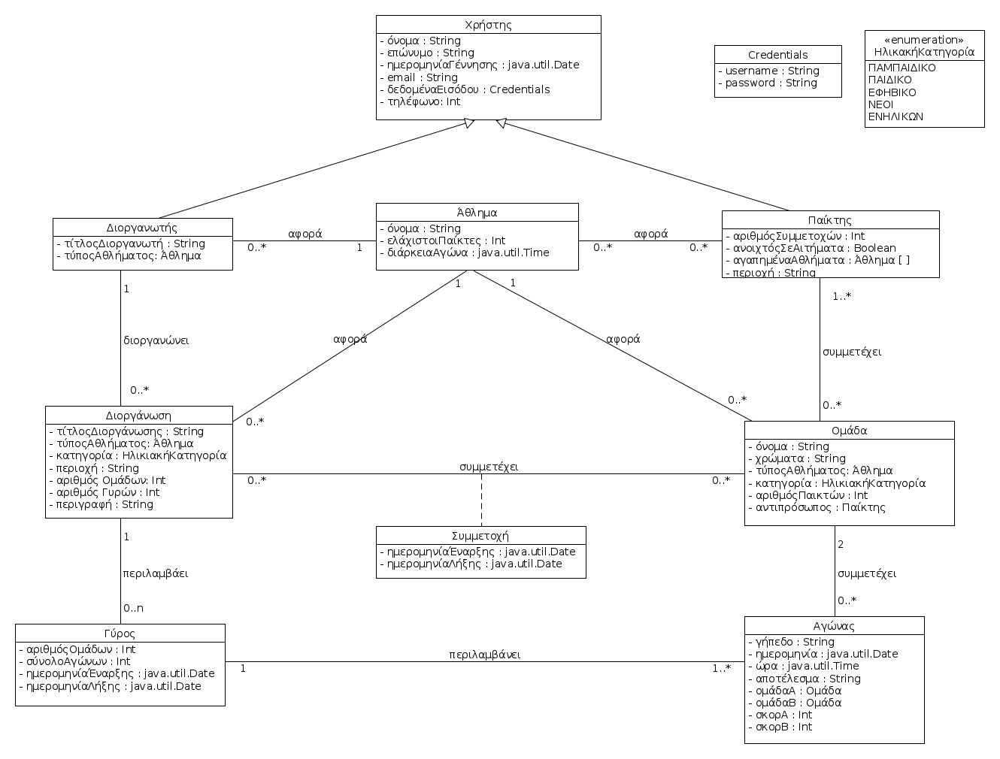

\[*Παρακάτω δίνεται μία περιγραφή του περιεχομένων του Εγγράφου Προδιαγραφών Απαιτήσεων Λογισμικού (ΕΠΑΛ) που βασίζεται σε πρότυπο περιπτώσεων χρήσης. Για κάθε ενότητα του εγγράφου γίνεται παραπομπή σε παραδείγματα του βιβλίου “Μ Γιακουμάκης, Ν. Διαμαντίδης, Τεχνολογία Λογισμικού, Σταμούλης, 2009”. Το παράδειγμα ενός συστήματος Τράπεζας έχει σχεδιαστεί από τον Β.Ζαφείρη στα πλαίσια φροντιστηρίων του μαθήματος Τεχνολογία Λογισμικού του Τμήματος Πληροφορικής του ΟΠΑ.*\]

# Εισαγωγή

\[*Μία εισαγωγή που αφορά το παρόν έγγραφο.*\]

## Εμβέλεια

\[*Περιγράφουμε τι θα κάνει και κυρίως τι δεν θα κάνει το λογισμικό. Βλέπε παράδειγμα 3-2 του βιβλίου στη σελίδα 139.*

*Ένα διάγραμμα περιβάλλοντος (πρωταρχικό διάγραμμα ροής δεδομένων) που βοηθά στην κατανόηση του συστήματος σε σχέση με το περιβάλλον του. Βλέπε το σχήμα 4-12 του παραδείγματος 4-1 στη σελίδα 185 του βιβλίου*\]

## Ορισμοί ακρώνυμα και συντομογραφίες

\[*Ένας πίνακας ακρωνύμων και συντομογραφιών που χρησιμοποιούνται στο έγγραφο. Ένας δεύτερος πίνακας με ορισμούς. Οι ορισμοί λαμβάνονται από το γλωσσάρι αν αυτό υπάρχει. Βλέπε πίνακα 3-5 του παραδείγματος 3-1 στη σελίδα 134.*\]

## Αναφορές

\[*Γράφουμε αν υπάρχουμε αναφορές σε άλλα έγγραφα (μελέτη σκοπιμότητας, ΕΠΑΣ, επιχειρησιακά μοντέλα κλπ). Σε περίπτωση που κάποια πληροφορία περιλαμβάνεται σε άλλο έγγραφο γίνεται η αναφορά στο άλλο έγγραφο και δεν επαναλαμβάνεται στο ΕΠΑΛ).*\]

## Επισκόπηση

\[*Γράφουμε πως οργανώνεται το υπόλοιπο έγγραφο*\]

# Συνολική περιγραφή

## Επισκόπηση μοντέλου περιπτώσεων χρήσης

*Διάγραμμα Περιπτώσεων Χρήσης.*

*Εισάγουμε έναν πίνακα με τους κωδικούς, τους τίτλους και μία σύντομη περιγραφή των περιπτώσεων χρήσης. Βλέπε πίνακα 3-8 του παραδείγματος 3-11 στη σελίδα 168 του βιβλίου*\]

## Υποθέσεις και εξαρτήσεις

\[*Γράφουμε τις υποθέσεις που κάνουμε και τις εξαρτήσεις του συστήματος σε σχέση με το περιβάλλον του.*\]

# Ειδικές Απαιτήσεις 

## Περιπτώσεις χρήσης

### Οι ενδιαφερόμενοι και οι ανάγκες τους

\[*Ένας πίνακας των ενδιαφερομένων (stakeholders) με τις ανάγκες τους. Βλέπε πίνακα 3-6 του παραδείγματος 3-2 στη σελίδα 138 του βιβλίου.*\]

### Actors του συστήματος

\[*Ένα πίνακας με του actors του συστήματος. Βλέπε πίνακας 3-7 παραδείγματος 3-11 στη σελίδα 167 του βιβλίου.*\]

### Περιγραφές περιπτώσεων χρήσης

\[*Γράφονται οι περιπτώσεις χρήσης οι οποίες συνοδεύονται με διαγράμματα δραστηριότητας εάν θεωρηθεί αναγκαίο.*

*Βλέπε , το παράδειγμα 3-7 στη σελίδα 159, το παράδειγμα 3-8 στη σελίδα 160 και το παράδειγμα 3-9 στη σελίδα 162.*\]

#### [ΠΧ1. Προβολή πληροφοριών διοργάνωσης](uc1-view-tournament-info.md)

#### [ΠΧ2. Διαχείριση Λογαριασμού Χρήστη ](uc2-user-account-management.md)

#### [ΠΧ3. Ταυτοποίηση Χρήστη](uc3-user-verification.md)

#### [ΠΧ4. Διαχείρηση στοιχείων διοργάνωσης](uc4-manage-tournament-data.md)

#### [ΠΧ5. Διεξαγωγή Διοργάνωσης](uc5-tournament-conduction.md)

#### [ΠΧ6. Αποδοχή αιτήματος ομάδας](uc6-accept-team-invite.md)

#### [ΠΧ7. Δήλωση ενδιαφέροντος για ομάδα](uc7-show-interest-for-a-team.md)

#### [ΠΧ8. Δήλωση συμμετοχής σε διοργάνωση](uc8-join-tournament.md)

#### [ΠΧ9. Δημιουργία ομάδας](uc9-team-creation.md)

#### [ΠΧ10. Αναζήτηση παικτών](uc10-player-search.md)

## Συμπληρωματικές προδιαγραφές

\[*Οι επόμενες ενότητες περιέχουν όλες τις μη λειτουργικές απαιτήσεις και τους περιορισμούς σχεδίασης και υλοποίησης.*\]

### Απαιτήσεις διεπαφών

#### Διεπαφές χρήστη

Στην διεπαφή θα υπάρχουν τα εξής στοιχεία:
1. Κουμπία σύνδεσης στο σύστημα με ταυτοποίηση και νέας εγγραφής.
2. Κουπιά για την επιλογή ρόλου κατα την εγγραφή (παίκτης ή διοργανωτής).
3. Φόρμα εισαγωγής των στοιχείων του χρήστη κατα την εγγραφή.
4.  Για τους διοργανωτές: Κουμπί δημιουργίας νέας διοργάνωσης, που εμφανίζει μία φόρμα συμπλήρωσης στοιχείων.
5. Για τους παίκτες: Κουμπί δημιουργίας νέας ομάδας, που εμφανίζει μία φόρμα συμπλήρωσης στοιχείων.
6. Όταν ένας παίκτης είναι αντιπρόσωπος, μπορεί να αναζητήσει άλλους παίκτες μέσω ενός καταλόγου. Εκεί θα υπάρχουν μενού με εφαρμογή φίλτρων αναζήτησης. Εναλλακτικά, θα υπάρχει πεδίο συμπλήρωσης, όπου μπορεί να βρεθεί παίκτης άμεσα μέσω του ονόματός του.
7. Στον αντιπρόσωπο θα εμφανίζονται κουμπιά για την πρόσκληση του παίκτη στην ομάδα και για την ακύρωση πρόσκλησης.
8. Ο αντιπρόσωπος θα μπορεί να αιτηθεί τη συμμετοχή της ομάδας του σε διοργάνωση, με κατάλληλο κουμπί που θα υπάρχει για κάθε διαθέσιμη διοργάνωση.
9. Όλοι οι χρήστες θα μπορούν να περιηγηθούν σε ένα κατάλογο απο τρέχουσες ή ολοκληρωμένες διοργανώσεις, και πατώντας σε μία θα μπορούν να δούν πληροφορίες για αυτή.

#### Διεπαφές υλικού

\[*Βλέπε πίνακα 5-2 του παραδείγματος 5-1 στη σελίδα 305*\]
Για την καλύτερη χρήση της διεπαφής απαιτείται οθόνη αφής.

#### Διεπαφές επικοινωνίας

Η χρήση της εφαρμογής απαιτεί σύνδεση στο Διαδίκτυο.

#### Διεπαφές λογισμικού

Η πλατφόρμα λειτουργεί μόνο σε συσκευές με το Λειτουργικό Σύστημα Android.

### Περιορισμοί σχεδίασης και υλοποίησης

Η υλοποίηση θα γίνει σε γλώσσα Java και Kotlin, στο περιβάλλον Android Studio.

### Ποιοτικά χαρακτηριστικά

#### Απόδοση

Η πλατφόρμα θα πρέπει να φέρνει εις πέρας τις λειρουργίες σε πραγματικό χρόνο. Αυτό σημαίνει άμεση αποστολή των αιτημάτων συμμετοχής και των αποδοχών, όπως επίσης και του verification mail.

#### Διαθεσιμότητα

Η απόκτηση το λογισμικού θα γίνεται είτε μέσω του Google Play, είτε με τον διαμοιρασμό του αρχείου apk .

#### Ασφάλεια

Διαχωρίζουμε τις δυνατότητες κάθε χρήστη μέσω της ταυτοποίησης του. Έτσι κάποιος παίκτης μπορεί να επεξεργαστεί τα στοιχεία του μόνο αν έχει ταυτοποιηθεί. Με αυτόν τον τρόπο προστατεύονται και οι διοργανωτές, ώστε να έχουν μόνο εκείνοι πρόσβαση στις διοργανώσεις τους.

#### Ευελιξία

\[*Βλέπε πίνακα 5-4 του παραδείγματος 5-1 στη σελίδα 306*\]

#### Ευχρηστία

Όλα τα στοιχεία της διεπαφής θα έχουν κατάλληλο μέγεθος ώστε να είναι διακρίνονται εύκολα. Σε κάθε οθόνη θα υπάρχουν μόνο στοιχεία που είναι αναγκαία για τους στόχους του χρήστη, και θα αποφεύγουμε τα έντονα χρώματα. Η περιήγιση στην πλατφόρμα θα μπορεί να γίνει έυκολα, χωρίς την χρήση manual.

# Υποστηρικτικό υλικό

## Μοντέλο πεδίου

## Ανάλυση περιπτώσεων χρήσης
--------------------------

### Κλάσεις ανάλυσης

\[*Εισάγουμε ένα διάγραμμα κλάσεων με την αρχική έκδοση των κλάσεων λογισμικού. Βλέπε σχήμα 4-104 του παραδείγματος 4-14 στη σελίδα 258 του βιβλίου*\]

Κλάσεις ανάλυσης που έχουν προκύψει από την ανάλυση των περιπτώσεων χρήσης *Διαχείριση Λογαριασμού* και *Διαχείριση Στοιχείων Πελάτη*.

### Συμπεριφορές

\[*Για κάθε σημαντική περίπτωση χρήσης εισάγουμε ένα διάγραμμα κλάσεων με τις κλάσεις που συμμετέχουν στη συμπεριφορά του συστήματος για την περίπτωση χρήσης. Το σημαντικότερο όμως είναι ένα διάγραμμα επικοινωνίας ή ακολουθίας που δείχνει την ανταλλαγή μηνυμάτων.*

*Βλέπε το παράδειγμα 4-16 στη σελίδα 262 του βιβλίου*\]

#### Άνοιγμα νέου λογαριασμού

#### Ανάληψη μετρητών από ταμείο

## Άλλα μοντέλα
------------

\[*Άλλα μοντέλα όπως για παράδειγμα διαγράμματα μηχανής καταστάσεων, πίνακες απόφασης κλπ. Βλέπε παράδειγμα 4-6 του βιβλίου*\]

## Επιχειρησιακοί κανόνες

\[*Ένας πίνακας με του επιχειρησιακούς κανόνες. Βλέπε πίνακα 3-4 του παραδείγματος 3-1 στη σελίδας 133 του βιβλίου.*\]

| Επιχειρησιακοί κανόνες | Περιγραφή |
| :----------------------| :---------|
| ΕΚ1 | Το username κάθε χρήστη πρέπει να είναι μοναδικό. 
| ΕΚ2 | Το username του παίκτη θα πρέπει να ξεχωρίζει από το username ενός διοργανωτή με κάποιο αλφαριθμητικό σύμβολο.
| ΕΚ3 | Η ηλικία των παικτών θα πρέπει να είναι άνω των 7 ετών.
| ΕΚ4 | Ο αριθμός τηλεφώνου κάθε χρήστη πρέπει να έχει 10 ψηφία.
| ΕΚ5 | Το όνομα της κάθε ομάδας θα πρέπει να είναι μοναδικό.
| ΕΚ6 | Η χρονική περίοδος κάθε διοργάνωσης δεν μπορεί να υπερβαίνει το ένα έτος.
| ΕΚ7 | Ο μέγιστος αριθμός παικτών ανά ομάδα πρέπει να είναι 25.
| ΕΚ8 | Κάθε ομάδα ανάλογα με την ηλικιακή κατηγορία της, μπορεί να συμμετέχει στην διοργάνωση με την αντίστοιχη ηλικιακή κατηγορία.
| ΕΚ9 | Κάθε διοργάνωση πρέπει να έχει έναν και μόνο νικητή.
| ΕΚ10 | Δεν μπορεί να κλείσει ή να διαγραφεί διοργάνωση όταν υπάρχουν αγώνες σε εξέλιξη.
| ΕΚ11 | Δεν μπορούν να συνυπάρχουν στην ίδια ομάδα άτομα, με μεγάλο εύρος στην ηλικία τους ( π.χ. 17 χρονών με 10 χρονών ).

