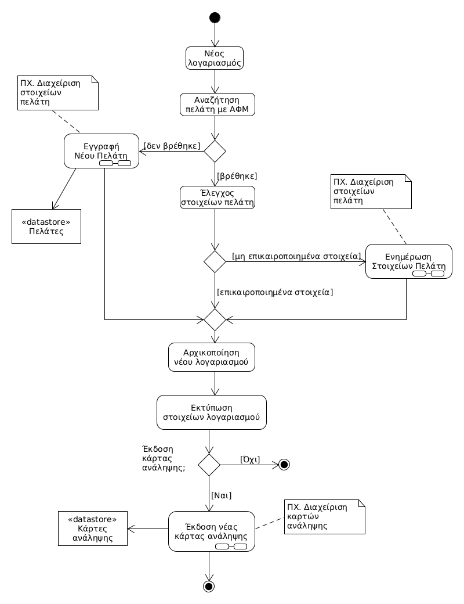

# ΠΧ2. Εγγραφή

**Πρωτεύων Actor**: Χρήστης  
**Ενδιαφερόμενοι**   
**Προϋποθέσεις**  

## Βασική Ροή

### Α) Εγγραφή παίκτη
1. Το σύστημα ζητάει στον χρήστη να εγγραφεί ως παίκτης ή ως διοργανωτής.
2. Ο χρήστης επιλέγει έναν απο τους παραπάνω ρόλους.
3. Το σύστημα εμφανίζει τα πεδία  που πρέπει να συμπληρωθούν για την εγγραφή.(Ονοματεπώνυμο, τηλέφωνο, credentials κλπ.)
4. Ο χρήστης συμπληρώνει τα πεδία.
5. Το σύστημα ελέγχει την εγκυρότητα των στοιχείων.
6. Το σύστημα στέλνει μήνυμα επιβεβαίωσης στη διεύθυνση email που έδωσε ο χρήστης.
7. Ο χρήστης επιβεβαιώνει την εγγραφή του εντός 24 ωρών.
8. Το σύστημα αποθηκεύει τα στοιχεία του νέου χρήστη.

## Εναλλακτικές Ροές

*5α. Τα στοιχεία δεν είναι έγκυρα*
1. Το σύστημα ζητάει απο τον χρήστη να διορθώσει τα σημεία που εντοπίζεται κάποιο λάθος.
	
*7α. Ο χρήστης δεν επιβεβαιώνει την εγγραφή του εντός 24 ωρών*
1. Τα στοιχεία του δεν αποθηκεύονται, και η εγγραφή δεν ολοκληρώνεται.

## Διαγράμματα

### Διάγραμμα δραστηριότητας - Εγγραφή

