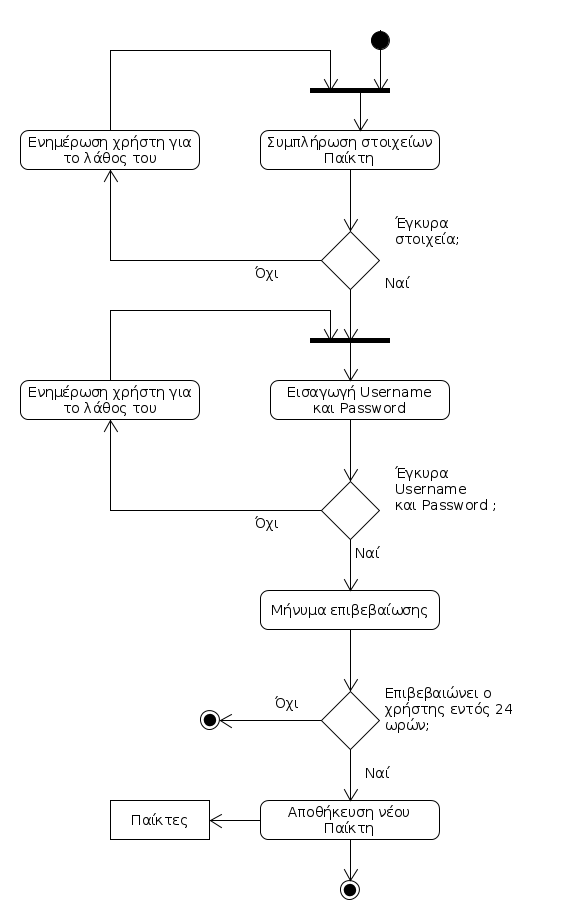
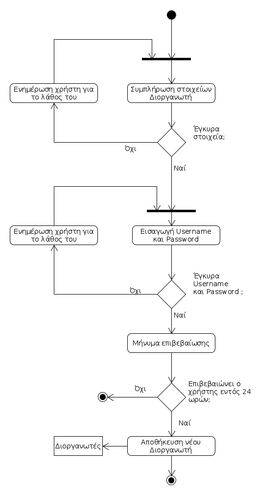
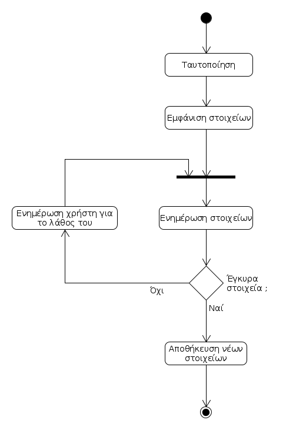
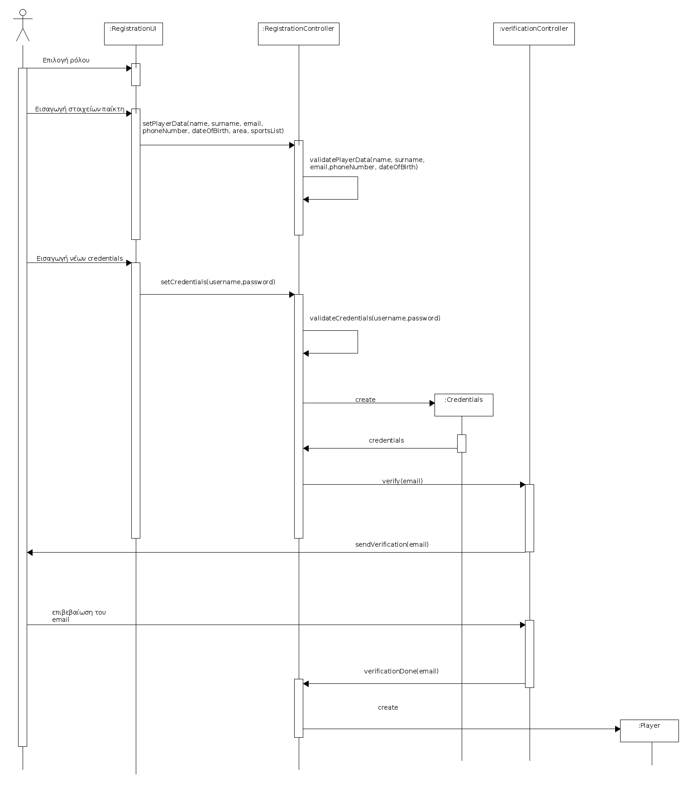

# ΠΧ2. Εγγραφή

**Πρωτεύων Actor**: Χρήστης  

**Ενδιαφερόμενοι**

**Προϋποθέσεις**  

## Βασική Ροή

### Α) Εγγραφή
1. Το σύστημα προτρέπει για εγγραφή ως παίκτης ή ως διοργανωτής.
2. Ο χρήστης επιλέγει έναν απο τους δύο ρόλους.
3. Ο χρήστης συμπληρώνει τα στοιχεία του ως παίκτης: ονοματεπώνυμο, τηλέφωνο, email, ημερομηνία γέννησης, περιοχή, αθλήματα που τον ενδιαφέρουν, ικανότητα σε κάθε άθλημα, θέση που παίζει.
4. Το σύστημα επιβεβαιώνει την ορθότητα των στοιχείων.
5. Ο χρήστης εισάγει Username και Password για τον νέο λογαριασμό.
6. Το σύστημα επιβεβαιώνει την ορθότητα των Username, Password.
7. Το σύστημα στέλνει μήνυμα επιβεβαίωσης στη διεύθυνση email που έδωσε ο χρήστης.
8. Ο χρήστης επιβεβαιώνει την εγγραφή του εντός 24 ωρών.
9. Το σύστημα αποθηκεύει τα στοιχεία του νέου χρήστη.

## Εναλλακτικές Ροές

*2α. Τα στοιχεία δεν είναι έγκυρα*
1. Το σύστημα ζητάει απο τον χρήστη να διορθώσει τα σημεία που εντοπίζεται κάποιο λάθος.
2. Η περίπτωση χρήσης επιστρέφει στο βήμα 3.

*3α. Ο χρήστης επέλεξε να εγγραφεί ως διοργανωτής*
1. 3. Ο χρήστης συμπληρώνει τα στοιχεία του ως διοργανωτής: τίτλος διοργανωτή, άθλημα, περιοχή, και ονοματεπώνυμο, τηλέφωνο,email, ημερομηνία γέννησης του υπεύθυνου.
2. Η περίπτωση χρήσης επιστρέφει στο βήμα 4.

*6α. Τα Username, Password δεν επιβεβαιώνονται*
1. Το σύστημα τονίζει τα σημεία που εντοπίζεται κάποιο λάθος.
2. Η περίπτωση χρήσης επιστρέφει στο βήμα 5.
	
*8α. Ο χρήστης δεν επιβεβαιώνει την εγγραφή του εντός 24 ωρών*
1. Τα στοιχεία του δεν αποθηκεύονται, και η εγγραφή δεν ολοκληρώνεται.

## Βασική Ροή

### Β) Επεξεργασία στοιχείων 
1. [Ταυτοποίηση Χρήστη](uc3-user-verification.md)
2. Ο χρήστης επιλέγει την ενημέρωση των στοιχείων του.
3. Το σύστημα εμφανίζει τα στοιχεία του χρήστη στην οθόνη.
4. Ο χρήστης εισάγει τις αλλαγές στα στοιχεία
5. Το σύστημα επιβεβαιώνει την ορθότητα των στοιχείων.
6. Το σύστημα αποθηκεύει τα τροποποιημένα στοιχεία.

## Εναλλακτικές Ροές

*5α. Τα στοιχεία δεν είναι έγκυρα*
1. Το σύστημα ζητάει απο τον χρήστη να διορθώσει τα σημεία που εντοπίζεται κάποιο λάθος.
2. Η περίπτωση χρήσης επιστρέφει στο βήμα 4.

## Βασική Ροή

### Γ) Διαγραφή χρήστη 
1. [Ταυτοποίηση Χρήστη](uc3-user-verification.md)
2. Ο χρήστης επιλέγει τη διαγραφή του.
3. Το σύστημα ενημερώνει τον χρήστη πως η διαγραφή είναι μη αναστρέψιμη.
4. Ο χρήστης επιβεβαιώνει πως θέλει να κάνει διαγραφή.
5. Το σύστημα διαγράφει τα στοιχεία του.

## Εναλλακτικές Ροές

*4α. Ο χρήστης δεν επιβεβαιώνει τη διαγραφή*
1. Η περίπτωση χρήσης τερματίζει.

## Διάγραμμα δραστηριότητας - Εγγραφή

### Διάγραμμα δραστηριότητας σενάριο χρήσης "Εγγραφή" ( 2Α )

### Διάγραμμα δραστηριότητας σενάριο χρήσης "Επεξεργασία στοιχείων" ( 2B )

### Διάγραμμα δραστηριότητας σενάριο χρήσης "Διαγραφή χρήστη" ( 2Γ )

### Διάγραμμα ακολουθίας σενάριο χρήσης "Εγγραφή" ( 2Α )

