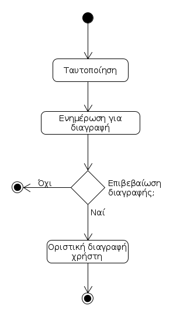

# ΠΧ2. Διαχείριση Λογαριασμού 

**Πρωτεύων Actor**: Χρήστης  

**Ενδιαφερόμενοι**:

**Χρήστης**: Θέλει να δημιουργεί, να επεξεργάζεται και να διαγράφει τους λογαριασμούς του.

**Προϋποθέσεις**: Ο χρήστης να θέλει να χρησιμοποιήσει την εφαρμογή.

## Βασική Ροή

### Α) Εγγραφή ως Παίκτης
1. Ο παίκτης συμπληρώνει τα στοιχεία του: ονοματεπώνυμο, τηλέφωνο, email, ημερομηνία γέννησης, περιοχή, αθλήματα που τον ενδιαφέρουν.
2. Το σύστημα επιβεβαιώνει την ορθότητα των στοιχείων.
3. Ο χρήστης εισάγει Username και Password για τον νέο λογαριασμό.
4. Το σύστημα επιβεβαιώνει την ορθότητα των Username, Password.
5. Το σύστημα στέλνει μήνυμα επιβεβαίωσης στη διεύθυνση email που έδωσε ο χρήστης.
6. Ο χρήστης επιβεβαιώνει την εγγραφή του εντός 24 ωρών.
7. Το σύστημα αποθηκεύει τα στοιχεία του νέου χρήστη.

## Εναλλακτικές Ροές

*2α. Τα στοιχεία δεν είναι έγκυρα επειδή δεν τηρούνται οι κανόνες: [ΕΚ3, ΕΚ4, ΕΚ13](software-requirements.md#business-rules)*
1. Το σύστημα ζητάει απο τον χρήστη να διορθώσει τα σημεία που εντοπίζεται κάποιο λάθος.
2. Η περίπτωση χρήσης επιστρέφει στο βήμα 1.

*4α. Τα Username και Password δεν είναι έγκυρα επειδή δεν τηρούνται οι κανόνες: [ΕΚ1, ΕΚ12](software-requirements.md#business-rules#)*
1. Το σύστημα τονίζει τα σημεία που εντοπίζεται κάποιο λάθος.
2. Η περίπτωση χρήσης επιστρέφει στο βήμα 3.
	
*6α. Ο χρήστης δεν επιβεβαιώνει την εγγραφή του εντός 24 ωρών*
1. Η περίπτωση χρήσης τερματίζει, χωρίς να έχει γίνει η εγγραφή.

## Βασική Ροή

### Β) Εγγραφή ως Διοργανωτής
1. Ο διοργανωτής συμπληρώνει τα στοιχεία : τίτλος διοργανωτή, άθλημα, περιοχή, και ονοματεπώνυμο, τηλέφωνο, email, ημερομηνία γέννησης του υπεύθυνου.
2. Το σύστημα επιβεβαιώνει την ορθότητα των στοιχείων.
3. Ο χρήστης εισάγει Username και Password για τον νέο λογαριασμό.
4. Το σύστημα επιβεβαιώνει την ορθότητα των Username, Password.
5. Το σύστημα στέλνει μήνυμα επιβεβαίωσης στη διεύθυνση email που έδωσε ο χρήστης.
6. Ο χρήστης επιβεβαιώνει την εγγραφή του εντός 24 ωρών.
7. Το σύστημα αποθηκεύει τα στοιχεία του νέου χρήστη.

## Εναλλακτικές Ροές

*2α. Τα στοιχεία δεν είναι έγκυρα επειδή δεν τηρούνται οι κανόνες: [ΕΚ4, ΕΚ13, ΕΚ14, ΕΚ15](software-requirements.md#Επιχειρησιακοί-κανόνες)*
1. Το σύστημα ζητάει απο τον χρήστη να διορθώσει τα σημεία που εντοπίζεται κάποιο λάθος.
2. Η περίπτωση χρήσης επιστρέφει στο βήμα 1.

*4α. Τα Username και Password δεν είναι έγκυρα επειδή δεν τηρούνται οι κανόνες: [ΕΚ1, ΕΚ12](software-requirements.md#business-rules#)*
1. Το σύστημα τονίζει τα σημεία που εντοπίζεται κάποιο λάθος.
2. Η περίπτωση χρήσης επιστρέφει στο βήμα 3.
	
*6α. Ο χρήστης δεν επιβεβαιώνει την εγγραφή του εντός 24 ωρών*
1. Η περίπτωση χρήσης τερματίζει, χωρίς να έχει γίνει η εγγραφή.

## Βασική Ροή

### Γ) Επεξεργασία στοιχείων 
1. [Ταυτοποίηση Χρήστη](uc3-user-verification.md)
2. Ο χρήστης επιλέγει την ενημέρωση των στοιχείων του.
3. Το σύστημα εμφανίζει τα στοιχεία του χρήστη στην οθόνη.
4. Ο χρήστης εισάγει τις αλλαγές στα στοιχεία
5. Το σύστημα επιβεβαιώνει την ορθότητα των στοιχείων.
6. Το σύστημα αποθηκεύει τα τροποποιημένα στοιχεία.

## Εναλλακτικές Ροές

*5α. Τα στοιχεία δεν είναι έγκυρα επειδή δεν τηρούνται οι κανόνες: [ΕΚ1, ΕΚ3, ΕΚ4, ΕΚ12, ΕΚ13, ΕΚ14, ΕΚ15](software-requirements.md#business-rules#)*
1. Το σύστημα ζητάει απο τον χρήστη να διορθώσει τα σημεία που εντοπίζεται κάποιο λάθος.
2. Η περίπτωση χρήσης επιστρέφει στο βήμα 4.

## Βασική Ροή

### Δ) Διαγραφή χρήστη 
1. [Ταυτοποίηση Χρήστη](uc3-user-verification.md)
2. Ο χρήστης επιλέγει τη διαγραφή του.
3. Το σύστημα ενημερώνει τον χρήστη πως η διαγραφή είναι μη αναστρέψιμη.
4. Ο χρήστης επιβεβαιώνει πως θέλει να κάνει διαγραφή.
5. Το σύστημα διαγράφει τα στοιχεία του.

## Εναλλακτικές Ροές

*4α. Ο χρήστης δεν επιβεβαιώνει τη διαγραφή*
1. Η περίπτωση χρήσης τερματίζει.

## Διαγράμματα

### **Διάγραμμα δραστηριότητας για σενάριο χρήσης "Εγγραφή ως παίκτης" ( 2Α )**

### **Διάγραμμα δραστηριότητας για σενάριο χρήσης "Εγγραφή ως διοργανωτής" ( 2B )**

### **Διάγραμμα δραστηριότητας για σενάριο χρήσης "Επεξεργασία στοιχείων" ( 2Γ )**

### **Διάγραμμα δραστηριότητας για σενάριο χρήσης "Διαγραφή χρήστη" ( 2Δ )**

### **Διάγραμμα ακολουθίας για σενάριο χρήσης "Εγγραφή ως παίκτης" ( 2Α )**

