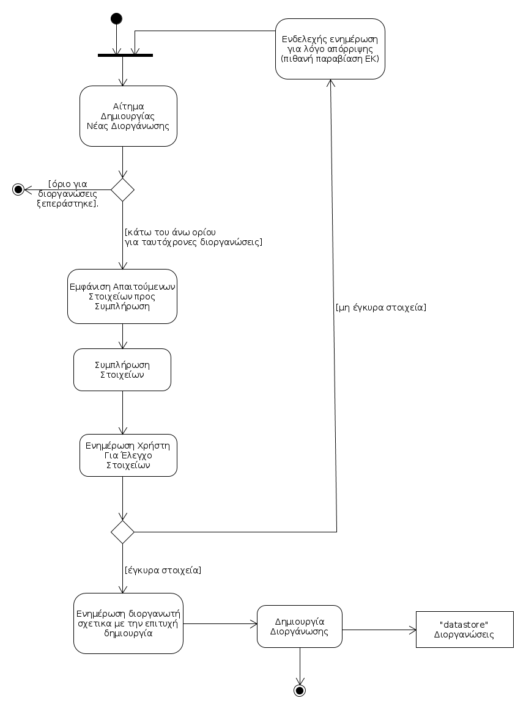

# ΠΧ4. Διαχείριση διοργάνωσης

**Πρωτεύων Actor**: Διοργανωτής 

**Ενδιαφερόμενοι**:

**Διοργανωτής**: Επιθυμεί να δημιουργεί-λήγει-τροποποιεί διοργανώσεις.

**Παίκτης**: Πιθανός συμμετέχων στην διοργάνωση που δημιούργησε ο διοργανωτής.

**Προϋποθέσεις**: Ο διοργανωτής να έχει ταυτοποιηθεί από το σύστημα.

## Βασική Ροή

### Α) Δημιουργία Διοργάνωσης.
1. Ο διοργανωτής επιλέγει από το μενού επιλογών του, "Δημιουργία νέας Διοργάνωσης"
2. Το σύστημα του εμφανίζει τη σελίδα με τα στοιχεία που πρέπει να συμπληρώσει (άθλημα, τύπος (3v3, 5x5, 11x11 κ.λ.π), εγκαταστάσεις, κόστος συμμετοχής, βραβεία, συνολικός αριθμός ομάδων, ημερομηνίες διεξαγωγής, όνομα διοργανωτή, ΑΦΜ, κ.λ.π).
3. Ο διοργανωτής συμπληρώνει όλα τα στοιχεία και επιλέγει "Δημιουργία".
4. Το σύστημα ενημερώνει το χρήστη ότι θα ελεγχθούν τα στοιχεία που υποβλήθηκαν και ότι θα λάβει ειδοποίηση εντός λίγων ημερών.
5. Το σύστημα επιβεβαιώνει το διοργανωτή για την επιτυχή δημιουργία της διοργάνωσης με προσωπικό μειλ και προσθέτει τη διοργάνωση στον πίνακα με όλες τις διοργανώσεις.

## Εναλλακτικές Ροές

*2α.Το σύστημα απορρίπτει το αίτημα για δημιουργία πριν τη συμπλήρωση των στοιχείων, καθώς παραβίαζεται ΕΚ?? σχετικός με το άνω όριο ταυτόχρονων διοργανώσεων που μπορεί να διεξάγει ένας διοργανωτής.*
1. Η περίπτωση χρήσης τερματίζει.

*5α. Το σύστημα δεν επιτρέπει στο χρήστη να δημιουργήσει διοργάνωση βάσει του ελέγχου στα στοιχεία που δόθηκαν.* 
1. Το σύστημα ενημερώνει το διοργανωτή για τον ακριβή λόγο που δεν μπόρεσε να δημιουργηθεί η διοργάνωση. [ΕΚ4, ΕΚ13, ΕΚ14, ΕΚ15](software-requirements.md#business-rules#)*
2. Επιστροφή στο βήμα 2 για εκ νέου προσπάθεια δημιουργίας διοργάνωσης, με ορθά στοιχεία.

## Βασική Ροή

### Β) Τροποποίηση επί μέρους στοιχείων διοργάνωσης
1. Επιλέγει μια διοργάνωση και πατά επεξεργασία.
2. Το σύστημα του εμφανίζει τα στοιχεία της συγκεκριμένης διοργάνωσης που επέλεξε.
3. Ο διοργανωτής τροποποιεί τα στοιχεία που επιθυμεί (όνομα, χορηγοί, βραβεία, κ.λ.π).
4. Το σύστημα ελέγχει για την εγκυρότητα των τροποποιήσεων.
5. Το σύστημα ενημερώνει το διοργανωτή για τις αλλαγές και του ζητά επιβεβαίωση.
6. Ο διοργανωτής επιβεβαιώνει.
7. Το σύστημα ενημερώνει τη διοργάνωση με τις νέες τροποποιήσεις.

## Εναλλακτικές Ροές

*1α. Ο διοργανωτής επιλέγει ακύρωση.*
1. Η περίπτωση χρήσης τερματίζει.

*5α. Τα στοιχεία δεν είναι έγκυρα.*
1. Το σύστημα εμφανίζει μήνυμα λάθους
2. Επιστροφή στο βήμα 3.

*3α. Ο διοργανωτής δεν μπορεί να τροποποιήσει τα στοιχεία σύμφωνα[ΕΚ4, ΕΚ13, ΕΚ14, ΕΚ15](software-requirements.md#business-rules#)*
1. Η περίπτωση χρήσης τερματίζει.

## Βασική Ροή

### Γ) Πέρας διοργάνωσης.
1. Ο διοργανωτής επιλέγει από το μενού επιλογών του, "Πέρας διοργάνωσης"
2. Το σύστημα εμφανίζει τις διοργανώσεις του διοργανωτή.
3. Ο διοργανωτής επιλέγει μία διοργάνωση από την λίστα.
4. Ο διοργανωτής επιλέγει να κλείσει την διοργάνωση.
5. Το σύστημα ενημερώνει τον διοργανωτή πως το κλείσιμο είναι μη αναστρέψιμο.
6. Ο διοργανωτής επιβεβαιώνει.
7. Το σύστημα ενημερώνει το διοργανωτή πως η διοργάνωση διαγράφηκε, και ταυτόχρονα αφαιρεί τη συγκεκριμένη διοργάνωση από τον πίνακα που κρατά όλες τις διοργανώσεις.

## Εναλλακτικές Ροές

*2α. Ο διοργανωτής επιλέγει ακύρωση.*
1. Η περίπτωση χρήσης τερματίζει.

*2β. Η λίστα με τις διοργανώσεις είναι άδεια.*
1. Το σύστημα εμφανίζει μήνυμα λάθους στο διοργανωτή.
2. Η περίπτωση χρήσης τερματίζει.

*6α. Η διοργάνωση δεν έχει ολοκληρωθεί σύμφωνα με [ΕΚ4, ΕΚ13, ΕΚ14, ΕΚ15](software-requirements.md#business-rules#)*
1. Το σύστημα εμφανίζει μήνυμα λάθους στο διοργανωτή.
2. Η περίπτωση χρήσης τερματίζει.

*6β. Ο διοργανωτής δεν επιβεβαιώνει.*
1. Η περίπτωση χρήσης τερματίζει.

## Διαγράμματα 

### **Διάγραμμα δραστηριοτήτων για σενάριο χρήσης "Δημιουργία διοργάνωσης" ( 4Α )**.

