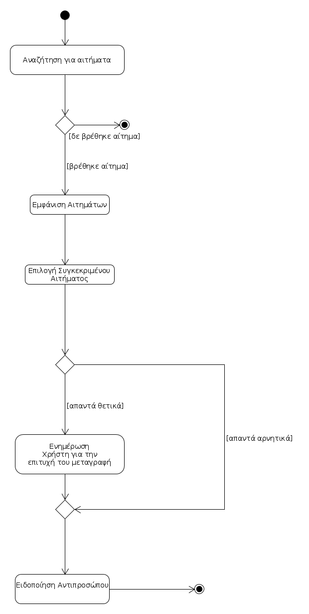

# ΠΧ6. Αποδοχή Αιτήματος Ομάδας 
**Πρωτεύων Actor**: Παίκτης

**Ενδιαφερόμενοι**:

**Παίκτης**: Αποδέχεται το αίτημα ώστε να συμμετάσχει στη συγκεκριμένη ομάδα.

**Αντιπρόσωπος**: Επιθυμεί να μάθει αν ο παίκτης αποδέχθηκε το αίτημα για συμμετοχή στην ομάδα του.

**Προϋποθέσεις**: 
1. Ο χρήστης να έχει δηλώσει ενδιαφέρον στο συγκεκριμένο τύπο διοργανώσεων ώστε να είναι διαθέσιμος και να του εμφανίζεται το συγκεκριμένο αίτημα.
2. Ο Αντιπρόσωπος να έχει στείλει αίτημα στον παίκτη για να συμμετάσχει στην ομάδα.

## Βασική Ροή

### Α) Αποδοχή Αιτήματος.
1. Ο παίκτης αναζητά στο σύστημα ενημερώσεις για αιτήματα από ομάδες.
2. Το σύστημα του εμφανίζει τα αιτήματα από όλες τις ομάδες.
3. Ο παίκτης επιλέγει το αίτημα που τον ενδιαφέρει.
4. Ο παίκτης απαντά θετικά.
5. Το σύστημα επιβεβαιώνει την επιλογή του και τον ενημερώνει ότι αποτελεί πλέον μέλος της αντίστοιχης ομάδας.
6. Το σύστημα ειδοποιεί τον αντιπρόσωπο της ομάδας ότι το αίτημά του έγινε αποδεκτό από το συγκεκριμένο παίκτη και ταυτόχρονα διαγράφει το αίτημα από τη λίστα.

## Εναλλακτικές Ροές

*2α. Δεν υπάρχει κανένα αίτημα από ομάδα.*

1. Η περίπτωση χρήσης τερματίζει.

*4α. Ο παίκτης απαντά αρνητικά.*

1. Το σύστημα επιβεβαιώνει την επιλογή του παίκτη και ειδοποιεί τον αντιπρόσωπο της ομάδας ότι το αίτημα του δεν έγινε αποδεκτό.
2. Η περίπτωση χρήσης τερματίζει.

## Διαγράμματα 

### Διάγραμμα δραστηριοτήτων για σενάριο χρήσης "Αποδοχή Αιτήματος" (6Α)

