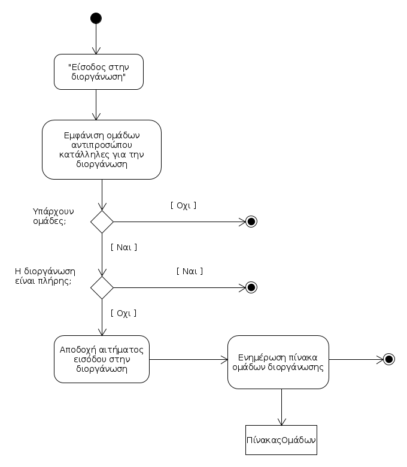
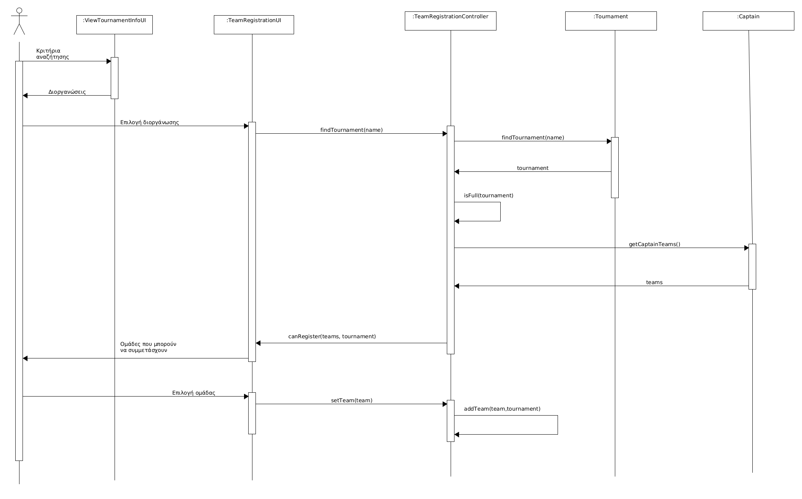

# ΠΧ8. Συμμετοχή σε Διοργάνωση

**Πρωτεύων Actor**: Αντιπρόσωπος 

**Ενδιαφερόμενοι**:

**Αντιπρόσωπος**: Επιθυμεί να συμμετάσχει σε διοργανώσεις και δηλώνει την ομάδα του.

**Παίκτης**: Επιθυμεί να συμμετάσχει σε διοργανώσεις για να παίξει.

**Προϋποθέσεις**: 
1. Ο αντιπρόσωπος να ταυτοποιηθεί από το σύστημα.
2. Ο αντιπρόσωπος να έχει δημιουργήσει ομάδα.
 
## Βασική Ροή

### Α) Είσοδος στην επιλεγμένη διοργάνωση.

1. Ο αντιπρόσωπος αναζητά διοργανώσεις μέσω της [Προβολή πληροφοριών διοργάνωσης](uc1-view-tournament-info.md) 
2. Ο αντιπρόσωπος επιλέγει την επιλογή "Είσοδος στην διοργάνωση", που του εμφανίζεται μαζί με τα στοιχεία της διοργάνωσης που έχει επιλέξει.
3. Το σύστημα εμφανίζει στον αντιπρόσωπο ένα αναδυόμενο παράθυρο με τις κατάλληλες ομάδες του αντιπροσώπου, που μπορούν να συμμετάσχουν στην διοργάνωση και του ζητάει να επιλέξει μία από αυτές.
4. Ο αντιπρόσωπος, επιλέγει την ομάδα που επιθυμεί να συμμετάσχει από την λίστα με τις ομάδες του.
5. Αν πληροί τις προυπόθεσεις της διοργάνωσης, το σύστημα αποδέχεται το αίτημα εισόδου και η ομάδα είναι πλέον στην διοργάνωση.
6. Το σύστημα ενημερώνει το πίνακα με τις ομάδες που συμμετέχουν στην διοργάνωση.

## Εναλλακτικές Ροές

*3α. Η λίστα με τις κατάλληλες ομάδες είναι άδεια.*
1. Το σύστημα ενημερώνει τον αντιπρόσωπο ότι δεν έχει δημιουργήσει ομάδα που να μπορεί να συμμετέχει στη συγκεκριμένη διοργάνωση.
2. Το σύστημα κατευθύνει τον χρήστη στην λίστα με τις διοργανώσεις του αθλήματος.

*3β. Η διοργάνωση που επιλέχθηκε έιναι πλήρης απο συμμετοχές.*
1. Το σύστημα ενημερώνει το χρήστη με κατάλληλο μήνυμα.
2. Το σύστημα κατευθύνει τον χρήστη στην λίστα με τις διοργανώσεις του αθλήματος.

*4α. Μη δυνατή η συμμετοχή σε μια διοργάνωση με παραπάνω της 1 ομάδας, σύμφωνα με ΕK;;;*
1. Το σύστημα ενημερώνει τον αντιπρόσωπο πως έχει ήδη δηλώσει συμμετοχή στη συγκεκριμένη διοργάνωση.
2. Επιστροφή στο βήμα 3.

## Βασική Ροή

### Β) Έξοδος από την επιλεγμένη διοργάνωση.

1. Ο αντιπρόσωπος κατευθύνεται από το μενού στις διοργανώσεις που συμμετέχει.
2. Το σύστημα εμφανίζει στον αντιπρόσωπο όλες τις διοργανώσεις που έχει λάβει μέρος.
3. Ο αντιπρόσωπος επιλέγει τη διοργάνωση από την οποία επιθυμεί να αποχωρήσει και επιλέγει "Αποχώρηση από τη διοργάνωση".
4. Το σύστημα εμφανίζει αναδυόμενο παράθυρο και ρωτά για επιβεβαίωση.
5. Ο αντιπρόσωπος επιβεβαιώνει.
6. Το σύστημα αποθηκεύει την επιλογή, ενημερώνει τον πίνακα με τις ομάδες που συμμετέχουν στη διοργάνωση και τον αντιπρόσωπο για την επιτυχή αποχώρηση.

## Εναλλακτικές Ροές

*3α. Ο αντιπρόσωπος αποχωρεί από τη σελίδα που εμφανίζει τις διοργανώσεις που συμμετέχει, χωρίς να προχωρήσει σε κάποια ενέργεια.*

1. Η περίπτωση χρήσης τερματίζει.

*4α. Δεν είναι δυνατή η αποχώρηση από τρέχουσα διοργάνωση συμφωνα με ΕΚ;;;*
1. Το σύστημα ενημερώνει με κατάλληλο μήνυμα το χρήστη πως δεν είναι δυνατή η αποχώρηση, λόγω του ότι η διοργάνωση έχει ήδη ξεκινήσει.
2. Η περίπτωση χρήσης τερματίζει.

=======

## Διαγράμματα 

### **Διάγραμμα δραστηριοτήτων για σενάριο χρήσης "  Είσοδος στην επιλεγμένη διοργάνωση" ( 8Α )**.

### **Διάγραμμα ακολουθίας για σενάριο χρήσης "  Είσοδος στην επιλεγμένη διοργάνωση" ( 8Α )**.

