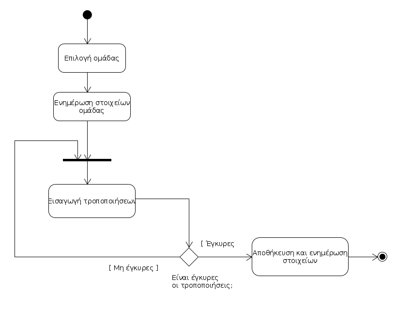
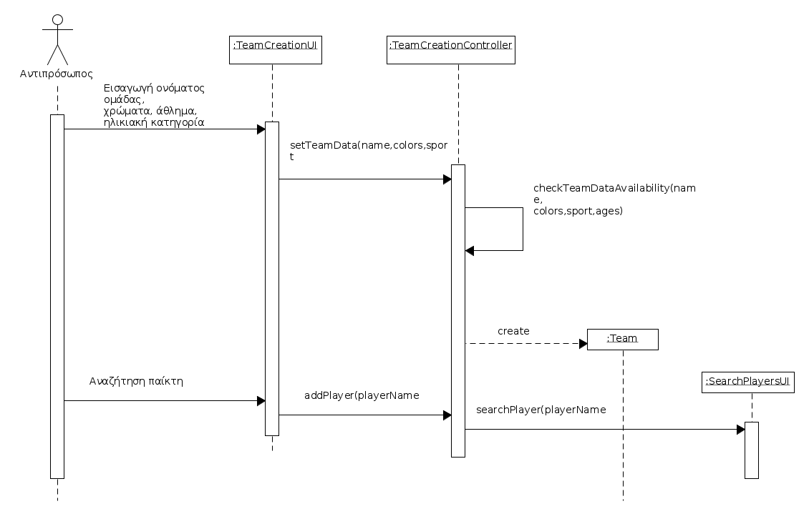

# ΠΧ9. Διαχείριση ομάδας

**Πρωτεύων Actor**: Αντιπρόσωπος 

**Ενδιαφερόμενοι**:

**Αντιπρόσωπος**: Επιθυμεί να δημιουργήσει μία ομάδα, να προσθέσει-αφαιρέσει μέλη κλπ.

**Παίκτης**: Επιθυμεί να συμμετάσχει στην ομάδα για την διοργάνωση.

**Προϋποθέσεις**: 
1. Ο Αντιπρόσωπος να έχει ταυτοποιηθεί από το σύστημα.

## Βασική Ροή

### Α) Δημιουργία ομάδας.
1. Ο αντιπρόσωπος εισάγει τα στοιχεία της ομάδας του : άθλημα, ηλικιακή ομάδα, χρώματα εμφανίσεων, όνομα.
2. Το σύστημα ελέγχει για την εγκυρότητα των στοιχείων.
3. Η ομάδα δημιουργείται και αποθηκεύεται στο σύστημα.
4. Ο αντιπρόσωπος προσκαλεί τους παίκτες μέσω της [Αναζήτησης Παικτών](uc10-player-search.md)

## Εναλλακτικές Ροές

*1α. Ο αντιπρόσωπος επιλέγει ακύρωση στην δημιουργία ομάδας*
1. Η περιπτωση χρήσης τερματίζει

*2α. Τα στοιχεία δεν είναι έγκυρα*
1. Το σύστημα εμφανίζει μήνυμα λάθους.
2. Πήγαινε στο Βήμα 1.

## Βασική Ροή

### Β) Επεξεργασία στοιχείων ομάδας.

1. Ο Αντιπρόσωπος επιλέγει μία από τις ομάδες του.
2. Ο Αντιπρόσωπος επιλέγει την ενημέρωση των στοιχείων της ομάδας.
3. Το σύστημα εμφανίζει τα στοιχεία της ομάδας του.
4. Ο Αντιπρόσωπος εισάγει τις αλλαγές στα στοιχεία.
5. Το σύστημα επιβεβαιώνει την ορθότητα των στοιχείων.
6. Το σύστημα αποθηκεύει τα τροποποιημένα στοιχεία.

## Εναλλακτικές Ροές

*1α. Ο αντιπρόσωπος επιλέγει ακύρωση στην επεξεργασία ομάδας*
1. Η περιπτωση χρήσης τερματίζει

*5α. Τα στοιχεία δεν είναι έγκυρα*
1. Το σύστημα ζητάει απο τον Αντιπρόσωπο να διορθώσει τα σημεία που εντοπίζεται κάποιο λάθος.
2. Πήγαινε στο Βήμα 4.

## Βασική Ροή

### Γ) Διαγραφή ομάδας.

1. Ο Αντιπρόσωπος επιλέγει μία από τις ομάδες του.
2. Το σύστημα εμφανίζει τα στοιχεία της ομάδας.
3. Ο Αντιπρόσωπος επιλέγει την διαγραφή ομάδας.
4. Το σύστημα ενημερώνει τον χρήστη πως η διαγραφή είναι μη αναστρέψιμη.
5. Ο Αντιπρόσωπος επιβεβαιώνει πως θέλει να κάνει διαγραφή.
6. Το σύστημα διαγράφει την ομάδα.

## Εναλλακτικές Ροές

*4α. Ο Αντιπρόσωπος δεν επιβεβαιώνει τη διαγραφή*
1. Η περίπτωση χρήσης τερματίζει.

## Διαγράμματα 

### **Διάγραμμα δραστηριοτήτων για σενάριο χρήσης "Δημιουργία ομάδας" ( 9Α )**.

### **Διάγραμμα δραστηριοτήτων για σενάριο χρήσης " Επεξεργασία στοιχείων ομάδας" ( 9Β )**.

### **Διάγραμμα δραστηριοτήτων για σενάριο χρήσης "Διαγραφή ομάδας" ( 9Γ )**.

### **Διάγραμμα ακολουθίας σενάριο χρήσης "Δημιουργία ομάδας" ( 9Α )**.

