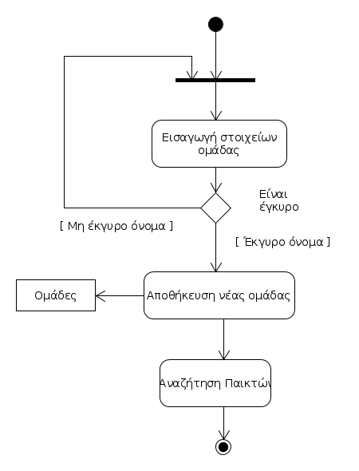
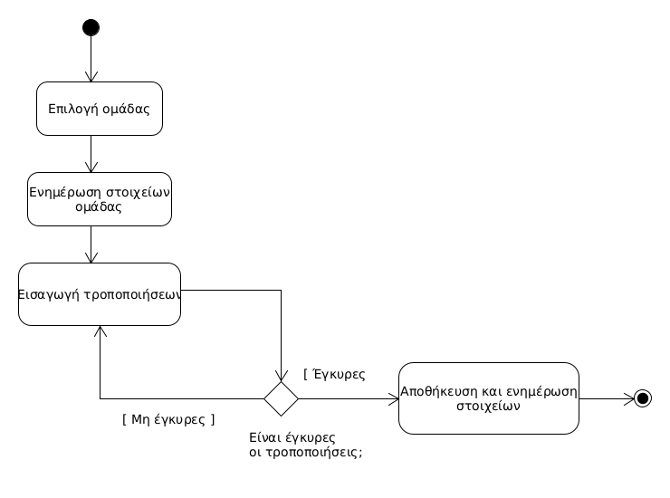

# ΠΧ9. Δημιουργία ομάδας

**Πρωτεύων Actor**: Αντιπρόσωπος 

**Ενδιαφερόμενοι**:

**Παίκτης**: Επιθυμεί να συμμετάσχει στην ομάδα για την διοργάνωση.

**Χρήστης**: Παρακολούθηση της αγαπημένης του ομάδας μέσω της πλατφόρμας ( βαθμολογία, στατιστικά ).

**Προϋποθέσεις**: 
1. Ο Αντιπρόσωπος να έχει ταυτοποιηθεί από το σύστημα.
2. Η ομάδα να είναι πλήρης, ανάλογα το άθλημα που επιλέγει να συμμετάσχει ο αντιπρόσωπος.

## Βασική Ροή

### Α) Εισαγωγή παικτών.

1. Ο αντιπρόσωπος επιλέγει το άθλημα, από ένα menu επιλογών.
2. Το σύστημα εμφανίζει την λίστα με τους διαθέσιμους παίκτες.
3. Ο αντιπρόσωπος επιλέγει τους παίκτες που επιθυμεί για την ομάδα του, κάνοντας είτε αναζήτηση ή κανονική επιλογή από την λίστα.
4. Το σύστημα ελέγχει για την εγκυρότητα της ηλικιακής διακύμανσης των παικτών( π.χ. να μην μπορεί να παίξουν στην ίδια ομάδα ένα παιδί 10 χρονών με ένα παιδί 17 χρονών ).
5. Αν είναι έγκυρη, το συστήμα ελέγχει για την πληρότητα της ομάδας, ανάλογα με το άθλημα που επιλέχθηκε ( π.χ. να υπάρχουν 5+ παίκτες αν είναι για μπάσκετ, 11+ αν είναι για ποδόσφαιρο ). 
6. Σε περίπτωση μη πληρότητας, το σύστημα κατευθύνει τον αντιπρόσωπο της ομάδας στην λίστα με τους διαθέσιμους παίκτες.
7. Ο αντιπρόσωπος αποστέλλει αιτήματα συμμετοχής στην ομάδα στους παίκτες που επιθυμεί.
8. Αν είναι πλήρης, το σύστημα κατευθύνει τον αντιπρόσωπο στην εισαγωγή στοιχείων της ομάδας.

**Εναλλακτικές Ροές**

*1α. Ο αντιπρόσωπος επιλέγει ακύρωση, στην δημιουργία ομάδας.*
1. Η περίπτωση χρήσης τερματίζει.

*2α. Η λίστα είναι άδεια.*
1. Το σύστημα εμφανίζει μήνυμα λάθους στον αντιπρόσωπο και η περίπτωση χρήσης τερματίζει.

*3α. Δεν υπάρχει παίκτης με αυτά τα στοιχεία, αν έχει κάνει αναζήτηση.*
1. Το σύστημα εμφανίζει μήνυμα λάθους στον αντιπρόσωπο.
2. Πήγαινε στο Βήμα 2.

*4α. Μη συμβατή ηλικιακή διακύμανση παικτών.*
1. Το σύστημα εμφανίζει μήνυμα λάθους στο αντιπρόσωπο.
2. Ο αντιπρόσωπος αναθεωρεί για τους παίκτες του και κατευθύνεται στο Βήμα 3. 

*5α. Η ομάδα είναι πλήρης.*
1. Πήγαινε στο Βήμα 8.

*7α. Δεν υπάρχουν διαθέσιμοι παίκτες για συμμετοχή*
1. Το σύστημα εμφανίζει μήνυμα λάθους και τερματίζει η περίπτωση χρήσης.

*7β. Δεν υπάρχει ακόμα απάντηση σε αιτήματα από παίκτες για να τηρείται η πληρότητα*
1. Το σύστημα εμφανίζει μήνυμα λάθους και τερματίζει η περίπτωση χρήσης.

*7γ. Δεν απάντησε επαρκής αριθμός παικτών θετικά στο αίτημα συμμετοχής.*
1. Το σύστημα εμφανίζει μήνυμα λάθους και τερματίζει η περίπτωση χρήσης.

### Β) Εισαγωγή στοιχείων ομάδας.

1. Ο αντιπρόσωπος μέσω μιάς φόρμας εισαγωγής κειμένου εισάγει το όνομα της ομάδας του.
2. Το σύστημα ελέγχει αν υπάρχει ήδη αυτό το όνομα από μία άλλη ομάδα, για το ίδιο άθλημα.
3. Αν είναι έγκυρο, ο αντιπρόσωπος επιλέγει τα χρώματα της ομάδας του.
4. Το σύστημα αποθηκεύει τις επιλογές του αντιπροσώπου και δημιουργείται η ομάδα.

**Εναλλακτικές Ροές**

*1α. Ο αντιπρόσωπος επιλέγει ακύρωση, στην δημιουργία ομάδας.*
1. Η περίπτωση χρήσης τερματίζει.

*2α. Υπάρχει ίδιο όνομα.*
1. Το σύστημα εμφανίζει μήνυμα λάθους στο διοργανωτή.
2. Τον κατευθύνει στο Βήμα 1.

## Διαγράμματα δραστηριοτήτων περιπτώση χρήσης 9.

### Διάγραμμα δραστηριοτήτων για σενάριο χρήσης "Εισαγωγή παικτών" ( 9Α ).

### Διάγραμμα δραστηριοτήτων για σενάριο χρήσης "Εισαγωγή στοιχείων ομάδας" ( 9Β ).

